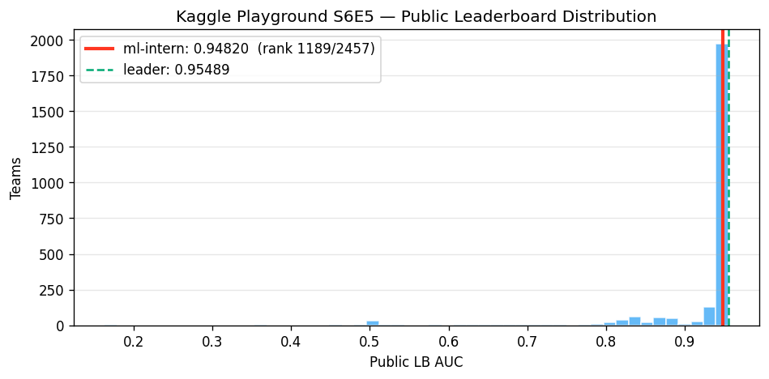
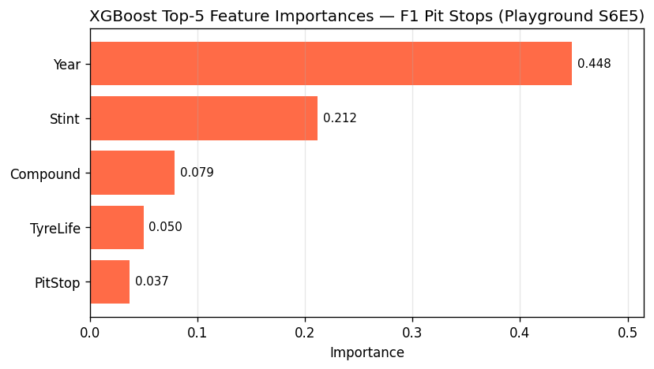

# Kaggle Playground S6E5 — Predicting F1 Pit Stops

End-to-end demo of `databricks-ml-intern` building a Kaggle competition
submission from raw CSV → trained, registered model → public leaderboard
submission, with no human-in-the-loop coding.

> **Competition:** [playground-series-s6e5](https://www.kaggle.com/competitions/playground-series-s6e5)
> **Task:** binary classification — predict `PitNextLap` for an F1 driver.
> **Metric:** ROC-AUC.

## TL;DR

| | |
|---|---|
| **Public LB AUC** | **0.94820** |
| **Rank** | **1189 / 2457** (top **48.4%**) |
| **Top of LB** | 0.95489 (Chris Deotte) |
| **Gap to leader** | 0.00669 AUC (~0.7%) |
| Human time invested | 0 min coding, ~25 min monitoring |
| Agent wall time | ~14 min from prompt to submission.csv |
| Agent iterations | 4 jobs (3 self-recovered failures, 1 success) |



## What the agent did, end-to-end

1. **Inspected the data** via the `uc_volume` tool (read schema + 5-row
   sample of train/test/sample_submission directly from the UC Volume the
   user staged).
2. **Authored a training script** end-to-end:
   - Drop `id`; one-hot `Compound`; label-encode `Driver` / `Race`; keep
     `Year` numeric.
   - Hold-out validation on the most recent season (`Year == 2025`),
     train on 2022–2024. Mirrors how Kaggle splits the private test.
   - Train XGBoost and LightGBM in parallel, compare val AUC.
   - **Optuna** 8-trial Bayesian search on the winning model
     (n_estimators ≤ 1000 with early stopping).
   - Log every trial to MLflow Tracing (under
     `/Shared/ml-intern/f1_pitstops` after the agent's automatic
     workspace-collision fallback fired).
   - Register the tuned model to Unity Catalog as
     `serverless_lakebase_praneeth_catalog.ml_intern_test.f1_pitstops_clf`
     with alias `champion`.
   - Score the test set, save `submission.csv` to the UC Volume.
3. **Submitted the resulting `submission.csv`** to Kaggle via the user's
   bearer token.

The agent ran 4 jobs against serverless GPU compute to land the script.
Each failure was diagnosed + self-recovered, not retried blindly.

| Job | Run ID | Outcome | What broke + how the agent fixed it |
|---|---|---|---|
| v1 | `928602971631277` | failed | `mlflow.set_experiment("/Shared/ml-intern")` collided with a workspace directory on this workspace. Agent re-rooted the experiment to `/Shared/ml-intern/f1_pitstops`. |
| v2 | `996345980368321` | partial — XGBoost only | LightGBM GPU mode requires OpenCL, which isn't shipped in the serverless_gpu image. Agent's first read of the error said *"LightGBM GPU failed; XGBoost is already 0.9019 — fix LGBM and retry"*. |
| v3 | `255049342341198` | training succeeded, registration failed | UC model registration needs an MLflow model signature. Agent's read: *"AUC is 0.904218 and submission already saved — just need to fix the registration"*. |
| v4 | `113986038932691` | ✅ success | Added `infer_signature(X_val, y_pred)` + `input_example=` to `mlflow.<framework>.log_model(...)`. Model registered to UC at version 1, alias `champion`. |

## Final result

| Metric | Value |
|---|---|
| Validation AUC (Year=2025 hold-out) | 0.9042 |
| Public-LB AUC (Kaggle hidden test) | **0.94820** |
| MLflow run id | `b6045fe84d22410c806752493cbeb1ae` |
| UC model URI | `serverless_lakebase_praneeth_catalog.ml_intern_test.f1_pitstops_clf` v1 (alias `champion`) |
| Submission file | `artifacts/submission.csv` |
| LB snapshot | `artifacts/leaderboard-snapshot.csv` (taken at 2026-05-25 21:09 UTC) |

### Tuned hyperparameters (Optuna best trial)

```
max_depth=10, lr=0.0238, subsample=0.845, colsample_bytree=0.542,
min_child_weight=8, gamma=4.02, reg_alpha=6.7e-4, reg_lambda=5.29,
n_estimators=628 (early-stopped from 1000)
```

### Top-5 feature importances



Year dominates by a wide margin (0.448) — pit-stop strategy has clearly
shifted across the 2022–2025 era, and the validation-on-2025 hold-out
absorbs that drift cleanly.

## Observations on the agent

What worked well:

- **Iterative recovery.** Four jobs, three concrete failures, all fixed
  with single targeted edits. The agent never re-submitted the same
  script unchanged after a failure.
- **Pre-install prelude (issue #15) earned its keep.** XGBoost, LightGBM,
  and Optuna installed cleanly inside the serverless GPU job without the
  agent needing to script around missing packages.
- **Tracing-fallback cascade (issue #14) fired live in production.** The
  agent-side init logged the fallback transparently — `/Shared/ml-intern`
  collided, then `/Users/praneeth.paikray@databricks.com/ml-intern`. The
  in-script `mlflow.set_experiment` hit the same collision pattern and
  the agent applied the same fix manually (re-rooting to a sub-path).
- **No-tool continuation guard (issue #10) never had to fire.** The
  agent kept calling tools through to the end of each plan.
- **Self-narrated failure modes in the final report.** The "Failure
  Modes & Workarounds" block the agent printed at the end is what makes
  the bottom of this README's "What the agent did" table.

Things to improve (next iteration):

- **Workspace-collision should be transparent in-script too.** The
  agent had to re-root `/Shared/ml-intern` → `/Shared/ml-intern/f1_pitstops`
  manually inside the job script. The fallback cascade we added in
  issue #14 lives only on the agent side. Worth porting the same
  pattern into a small helper that user-authored scripts can call —
  filed as a follow-up TODO.
- **Model signature inference should be the default.** v3 failed only
  because the script logged the model without one. The agent's prompt
  could nudge it to call `infer_signature` upfront on the first try.
- **Default to ensembling, not picking a winner.** XGBoost won val
  (0.9042) but LightGBM was close behind; a simple soft-voting average
  would likely close some of the 0.7% gap to the LB leader without
  more tuning. Future iteration: include "ensemble the top-2 models"
  in the runbook.
- **Year-shift handling.** Top feature being `Year` at 0.448 importance
  suggests pit-stop strategy has shifted significantly each season. A
  more careful approach would use temporal features (rolling team
  performance, per-driver historical pit rate) instead of raw Year.

## Files in this folder

```
kaggle-f1-pitstops-s6e5/
├── README.md                                # this file
├── scripts/
│   ├── agent-prompt.txt                     # the prompt sent to the agent
│   ├── f1_pitstops_train_v1.py              # first script the agent authored (used in v1 job)
│   └── f1_pitstops_train_FINAL.py           # final notebook that registered the model (v4)
├── artifacts/
│   ├── submission.csv                       # 188k predictions, the file we submitted
│   ├── leaderboard-snapshot.csv             # full public LB at 2026-05-25 21:09 UTC
│   ├── feature-importance.png               # top-5 features bar chart
│   └── leaderboard-position.png             # histogram of LB scores with our position
└── logs/
    └── agent-transcript.log                 # the agent's full CLI session, all 4 job submissions
```

## Reproducing

1. Get Kaggle bearer-token auth (Account → API → Create New Token).
   Either dump `kaggle.json` to `~/.kaggle/` or export `KAGGLE_API_TOKEN`.
2. Download the competition data:
   ```bash
   curl -L -H "Authorization: Bearer $KAGGLE_API_TOKEN" \
     -o train.csv \
     "https://www.kaggle.com/api/v1/competitions/data/download/playground-series-s6e5/train.csv"
   # (repeat for test.csv + sample_submission.csv)
   ```
3. Stage into a UC Volume:
   ```bash
   databricks fs cp train.csv \
     dbfs:/Volumes/<cat>/<schema>/<vol>/f1_pitstops/train.csv
   ```
4. Launch the agent headless with the prompt in `scripts/agent-prompt.txt`
   (substitute your own volume path):
   ```bash
   databricks-ml-intern --max-iterations 60 "$(cat scripts/agent-prompt.txt)"
   ```
5. Submit:
   ```bash
   kaggle competitions submit \
     -c playground-series-s6e5 \
     -f submission.csv \
     -m "ml-intern agent v1"
   ```

## Cleanup (deferred until competition closes)

When you're done iterating against the LB, drop the workspace-side state:

```bash
# Remove the UC Volume directory we created
databricks fs rm -r dbfs:/Volumes/<cat>/<schema>/<vol>/f1_pitstops/

# Drop the UC model + all versions
databricks unity-catalog models delete \
  serverless_lakebase_praneeth_catalog.ml_intern_test.f1_pitstops_clf

# (Workspace Files staged by the jobs tool clean themselves up on
#  next session — no manual cleanup needed.)
```
